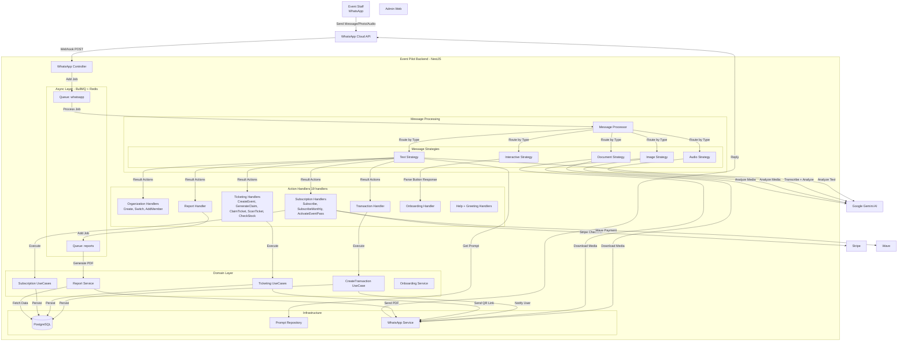

# Architecture Technique Globale - EventPilot

## Vue d'Ensemble

EventPilot est une application construite sur **NestJS** suivant une **Architecture Hexagonale (Ports & Adapters)** stricte. Elle utilise une approche événementielle asynchrone pour le traitement des messages WhatsApp.

## Modules Fonctionnels

L'application est découpée en **13 modules** indépendants :

| Module           | Responsabilité                   | Couches                                         |
| ---------------- | -------------------------------- | ----------------------------------------------- |
| **Organization** | Gestion multi-entités et membres | Domain, Application, Infrastructure             |
| **User**         | Utilisateurs WhatsApp            | Domain, Infrastructure                          |
| **Transaction**  | Écritures financières            | Domain, Application, Infrastructure             |
| **Incident**     | Main courante numérique          | Domain, Infrastructure                          |
| **Subscription** | Abonnements SaaS et Event Pass   | Domain, Application, Infrastructure             |
| **Ticketing**    | Événements, billets, QR codes    | Domain, Application, Infrastructure             |
| **Payment**      | Intégration Stripe & Wave        | Domain, Application, Infrastructure             |
| **Report**       | Génération PDF (Flash, Weekly)   | Domain, Application, Infrastructure             |
| **Feedback**     | Collecte notes post-événement    | Domain, Application, Infrastructure             |
| **Onboarding**   | Tutoriel interactif 5 étapes     | Domain, Application, Infrastructure             |
| **Webhook**      | Point d'entrée WhatsApp          | Application (Controllers, Handlers, Strategies) |
| **Common**       | LLM, Guards, WhatsApp Service    | Shared services                                 |
| **Auth**         | Magic Link, JWT, Guards          | Domain, Application, Infrastructure             |

## Diagramme des Flux (Sequence & Components)

## Composants Clés

### 1. Webhook & File d'Attente (Ingress)

- **WhatsAppController** : Reçoit les payloads bruts de Meta. Valide la signature et met le message en file d'attente (`whatsapp`).
- **RawBodyMiddleware** : Capture le body brut pour la validation de signature.
- **Objectif** : Répondre instantanément (200 OK) à WhatsApp pour éviter les timeouts, et lisser la charge.

### 2. Processeur de Messages & Stratégies

- **MessageProcessor** : Consomme la file d'attente BullMQ.
- **7 Stratégies** implémentées (Pattern Strategy) :

| Stratégie                    | Type de message | Traitement                           |
| ---------------------------- | --------------- | ------------------------------------ |
| `TextMessageStrategy`        | Texte           | Analyse LLM avec prompt dynamique    |
| `AudioMessageStrategy`       | Vocal           | Transcription + Analyse LLM          |
| `ImageMessageStrategy`       | Photo           | Téléchargement + Analyse multimodale |
| `DocumentMessageStrategy`    | Fichier         | Téléchargement + OCR intelligent     |
| `InteractiveMessageStrategy` | Boutons         | Parse réponse (Onboarding, Feedback) |
| `BaseMessageStrategy`        | Abstract        | Classe parente commune               |

### 3. LLM Provider (Google Gemini)

- Interface `ILLMProvider` abstraite.
- `GeminiLLMProvider` implémente :
  - `analyzeText` : Analyse d'intents multiples (Transaction, Incident, Rapport...).
  - `analyzeMedia` : Analyse visuelle des factures ou incidents (via `inlineData`).
- `FakeLLMProvider` : Mock pour tests unitaires.

### 4. Action Handlers (Chain of Responsibility)

Le résultat de l'IA est une liste d'Actions. `ProcessMessageUseCase` itère sur ces actions et délègue au Handler approprié (`IActionHandler`).

**19 Handlers implémentés** :

| Groupe           | Handlers                                                                                                     |
| ---------------- | ------------------------------------------------------------------------------------------------------------ |
| **Organisation** | `CreateOrganizationHandler`, `SwitchOrganizationHandler`, `AddMemberHandler`                                 |
| **Transactions** | `CreateTransactionHandler`, `AskDataHandler`                                                                 |
| **Événements**   | `CreateEventHandler`, `GenerateClaimHandler`, `ClaimTicketHandler`, `ScanTicketHandler`, `CheckStockHandler` |
| **Abonnements**  | `SubscribeHandler`, `SubscribeMonthlyHandler`, `ActivateEventPassHandler`                                    |
| **Rapports**     | `GenerateReportHandler`                                                                                      |
| **Onboarding**   | `OnboardingHandler`                                                                                          |
| **Utilitaires**  | `GreetingHandler`, `HelpHandler`, `NotImplementedHandler`                                                    |

### 5. Persistance & Infrastructure

- **PostgreSQL** : Base de données relationnelle.
- **MikroORM** : Mapping entités du Domaine (Schema-based, domaine pur).
- **Redis + BullMQ** : Files d'attente asynchrones.
- **PromptRepository** : Prompts système modifiables sans redéploiement.
- **EventEmitter** : Communication événementielle inter-modules.
- **ScheduleModule** : Jobs planifiés (rapports automatiques).

### 6. Paiements

Deux providers supportés :

| Provider   | Usage                                      | Intégration                 |
| ---------- | ------------------------------------------ | --------------------------- |
| **Stripe** | Abonnements mensuels, Europe/International | Checkout Session + Webhooks |
| **Wave**   | Paiements Afrique de l'Ouest (FCFA)        | API Wave + Callbacks        |

### 7. Module Ticketing

Gestion complète de la billetterie événementielle :

- **Event** : Entité représentant un événement (capacité, prix, date)
- **Ticket** : Billet individuel avec statut (VALID, USED, CANCELLED)
- **TicketClaim** : Génération de liens sécurisés avec hash
- **Scan** : Validation par photo QR via WhatsApp

### 8. Module Onboarding

Tutoriel interactif en 5 étapes :

1. **Welcome** : Bienvenue automatique
2. **CreateFirstTransaction** : Première dépense
3. **AddTeamMember** : Ajout collaborateur (OWNER/MANAGER)
4. **GenerateReport** : Premier rapport PDF
5. **Subscribe** : Activation abonnement (OWNER)

Le système suit la progression et envoie des félicitations contextuelles.

### 9. Module Feedback

Collecte automatique des retours post-événement :

- Envoi automatique après chaque événement terminé
- Notation 1-5 étoiles via boutons interactifs
- Stockage pour analyse et amélioration continue

### 10. Module Auth (Dashboard)

Module d'authentification pour le futur Dashboard Web :

- **Magic Link** : Authentification sans mot de passe via WhatsApp
- **JWTs** : Sessions utilisateur sécurisées (sub, role, phone)
- **Hybrid Guards** :
  - `ApiKeyGuard` : Pour accès M2M (scripts, crons)
  - `JwtAuthGuard` : Pour accès utilisateur (Dashboard)
  - `CompositeAuthGuard` : Combine les deux pour flexibilité

**Endpoints :**

- `POST /auth/magic-link` : Demande de lien de connexion
- `GET /auth/verify?token=...` : Validation et génération JWT
