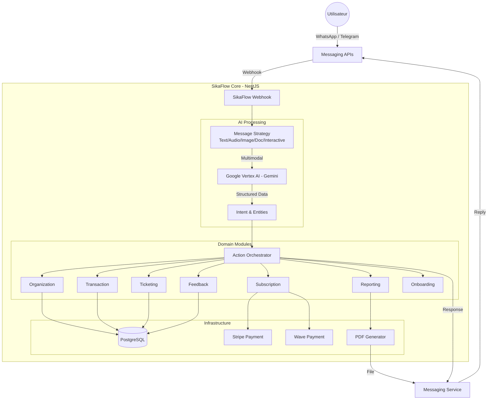
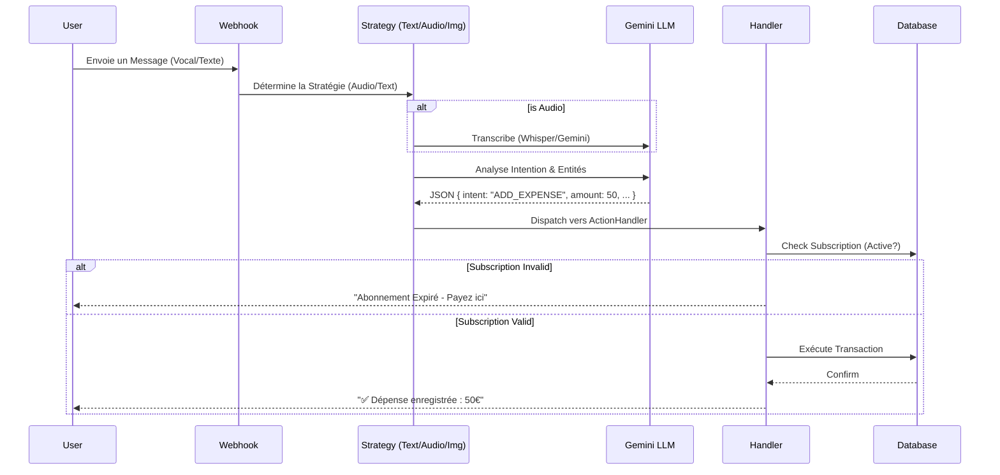
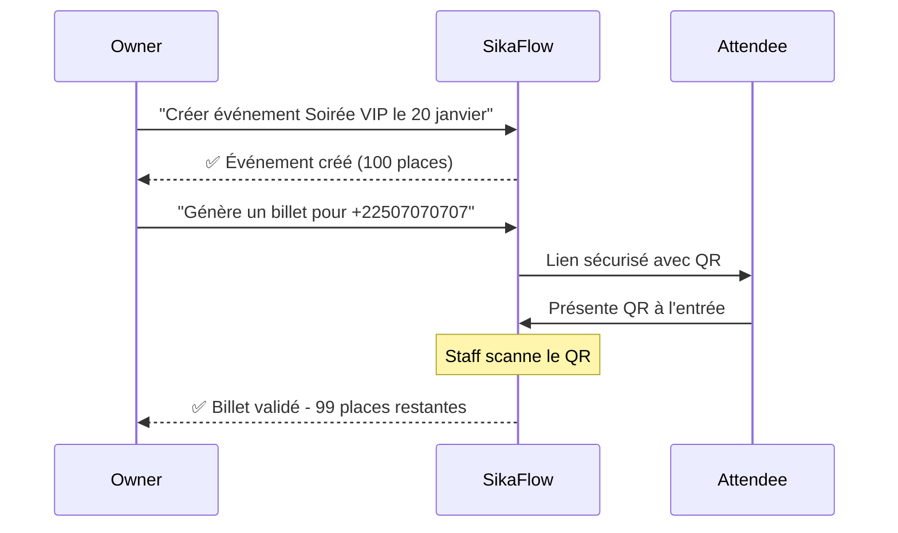

# 📑 Spécifications Fonctionnelles & Architecture - SikaFlow

## 1. Vision du Produit

**SikaFlow** est une plateforme de **gestion financière pour PME** (restaurants, bars, maquis, commerces et organisateurs d'événements), entièrement pilotée par **Intelligence Artificielle** via une interface **WhatsApp et Telegram**. Le cœur fonctionnel couvre la trésorerie, les créances, les contacts et le reporting ; la billetterie événementielle est l'un des verticaux pris en charge.

L'objectif est de supprimer la friction des applications traditionnelles (téléchargement, login, formation) en s'intégrant là où les équipes communiquent déjà : leurs messageries instantanées préférées.

## 2. Architecture Technique

Le projet repose sur une architecture **Hexagonale (Ports & Adapters)** stricte, garantissant l'indépendance de la logique métier vis-à-vis des technologies externes.

### 2.1 Schéma Global de l'Architecture

### 2.2 Flux de Traitement des Messages (Orchestration)

Le flux de traitement d'un message suit une logique rigoureuse de "Stratégie -> Analyse -> Action".

## 3. Modules Fonctionnels

### 3.1 Gestion de l'Organisation (Organization)

- **Multi-Entités** : Un utilisateur peut appartenir à plusieurs organisations (ex: Propriétaire de 3 clubs).
- **Rôles Hiérarchiques** :
  - `OWNER` : Accès total, gestion des membres, abonnement, rapports financiers complets.
  - `MANAGER` : Gestion opérationnelle, accès aux rapports limités, ajout de staff.
  - `STAFF` : Saisie simple (dépenses/incidents), pas de visibilité financière globale.
- **Switch Context** : Changement d'organisation active via "Switch [nom]".

### 3.2 Gestion Financière & Transactions (Transaction)

L'IA permet une saisie "naturelle" des finances.

- **Entrées Multimodales** :
  - _Texte_ : "Achat de 5 caisses de bière pour 20000"
  - _Vocal_ 🎙️ : Enregistrement rapide en plein service.
  - _Photo_ 📸 : Photo d'une facture fournisseur -> OCR intelligent.
- **Catégorisation Automatique** : L'IA détecte si c'est une `Dépense` ou un `Revenu`, et assigne la catégorie (Logistique, Boisson, Marketing).

### 3.3 Reporting Automatisé (Report)

Génération de documents professionnels au format PDF.

- **Flash Report** : Résumé de la soirée (Ventes, Dépenses cash, Incidents) envoyé à la fermeture.
- **Daily Report** : Bilan quotidien pour abonnés mensuels actifs.
- **Weekly Report** : Bilan hebdomadaire consolidé (P&L, Marges) pour les propriétaires.
- **Format** : PDF riche généré via `PDFKit`, partagé directement dans la conversation WhatsApp ou Telegram.

### 3.4 Sécurité & Incidents (Incident)

Un "Main Courante" numérique.

- Signalement rapide d'incidents (Bagarre, Vol, Problème technique).
- Niveaux de sévérité (`LOW`, `MEDIUM`, `HIGH`, `CRITICAL`).
- Statut de suivi (`OPEN`, `RESOLVED`).
- Alertes temps réel pour le Manager/Owner.

### 3.5 Abonnements & Monétisation (Subscription)

Modèle hybride adapté à l'événementiel :

| Type             | Description                                    | Durée               | Renouvellement       |
| ---------------- | ---------------------------------------------- | ------------------- | -------------------- |
| **SaaS Mensuel** | Établissements permanents (Clubs, Restaurants) | 1 mois              | Auto via Stripe/Wave |
| **Event Pass**   | Festival ou concert ponctuel                   | Configurable (48h+) | One-shot             |

**Providers de paiement** :

- **Stripe** : International, cartes bancaires
- **Wave** : Afrique de l'Ouest (FCFA), mobile money

### 3.6 Billetterie (Ticketing)

Gestion complète des événements et billets.

- **Création d'Événement** : Nom, date, capacité, prix unitaire.
- **Génération de Billets** : Lien sécurisé avec QR code unique (hash cryptographique).
- **Claim** : Attribution d'un billet à un numéro de téléphone.
- **Scan** : Validation via photo du QR → vérifie hash et statut.
- **Statuts Billet** : `VALID`, `USED`, `CANCELLED`.

### 3.7 Onboarding Interactif (Onboarding)

Tutoriel guidé en 5 étapes pour les nouveaux utilisateurs.

| Étape                   | ID                         | Rôles          | Action déclencheur          |
| ----------------------- | -------------------------- | -------------- | --------------------------- |
| 1️⃣ Bienvenue            | `WELCOME`                  | Tous           | Création organisation       |
| 2️⃣ Première Transaction | `CREATE_FIRST_TRANSACTION` | Tous           | Enregistrer dépense/recette |
| 3️⃣ Ajouter Membre       | `ADD_TEAM_MEMBER`          | OWNER, MANAGER | Inviter collaborateur       |
| 4️⃣ Générer Rapport      | `GENERATE_REPORT`          | OWNER, MANAGER | Demander "Rapport"          |
| 5️⃣ Activer Abonnement   | `SUBSCRIBE`                | OWNER          | Souscrire à un plan         |

- Progression persistée par organisation/utilisateur.
- Messages de félicitation contextuels à chaque complétion.
- Filtrage des étapes selon le rôle.

### 3.8 Feedback Post-Événement (Feedback)

Collecte automatique des retours participants.

- **Déclenchement** : Automatique après la date de fin d'événement.
- **Format** : Boutons interactifs (WhatsApp & Telegram).
- **Données collectées** : `eventId`, `attendeePhone`, `rating`, `comment`.
- **Usage** : Amélioration continue, statistiques pour organisateurs.

## 4. Modèle de Données (Entités Clés)

Les données sont stockées dans PostgreSQL avec une structure relationnelle forte.

### 4.1 Entités Principales

| Entité                 | Description                 | Propriétés clés                                                                  |
| ---------------------- | --------------------------- | -------------------------------------------------------------------------------- |
| **User**               | Utilisateur unique          | `phoneNumber` (ou `telegramId`), `lastActiveOrganizationId`, `preferredLanguage` |
| **Organization**       | Entité légale ou lieu       | `name`, `ownerId`, `subscriptionExpiresAt`, `settings`                           |
| **OrganizationMember** | Relation User-Organization  | `organizationId`, `userId`, `role`, `joinedAt`                                   |
| **Transaction**        | Écriture financière validée | `amount`, `type`, `category`, `organizationId`                                   |
| **Incident**           | Signalement sécurité        | `severity`, `status`, `description`, `occurredAt`                                |

### 4.2 Entités Abonnement

| Entité               | Description       | Propriétés clés                                               |
| -------------------- | ----------------- | ------------------------------------------------------------- |
| **Subscription**     | Abonnement actif  | `type`, `status`, `stripeSubscriptionId`, `waveTransactionId` |
| **SubscriptionPlan** | Plans disponibles | `name`, `price`, `currency`, `features`                       |
| **EventPass**        | Pass événementiel | `durationHours`, `activatedAt`, `expiresAt`                   |

### 4.3 Entités Billetterie

| Entité          | Description        | Propriétés clés                                       |
| --------------- | ------------------ | ----------------------------------------------------- |
| **Event**       | Événement          | `name`, `date`, `totalCapacity`, `soldCount`, `price` |
| **Ticket**      | Billet individuel  | `eventId`, `attendeePhone`, `status`, `secureHash`    |
| **TicketClaim** | Réclamation billet | `ticketId`, `claimUrl`, `claimedAt`                   |

### 4.4 Entités Support

| Entité                   | Description          | Propriétés clés                                 |
| ------------------------ | -------------------- | ----------------------------------------------- |
| **EventFeedback**        | Retour participant   | `eventId`, `attendeePhone`, `rating`, `comment` |
| **OnboardingProgress**   | Avancement tutoriel  | `userId`, `organizationId`, `completedSteps`    |
| **OnboardingStepConfig** | Configuration étapes | `stepId`, `title`, `requiredRoles`, `order`     |

## 5. Sécurité

- **Authentification** : Basée sur le numéro de téléphone WhatsApp ou l'ID Telegram (vérifié par les plateformes respectives).
- **Autorisation** : RBAC (Role-Based Access Control) vérifié à chaque action critique.
- **Context-Isolation** : Un utilisateur ne peut interagir qu'avec l'organisation "active". Pour changer, il doit explicitement demander un "Switch".
- **Validation Signature** : Tous les webhooks (WhatsApp & Telegram) sont validés via signature cryptographique (HMAC).
- **Encryption** : Hash sécurisé pour les billets (protection QR).
