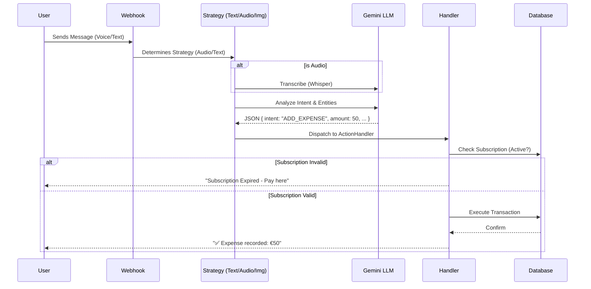

# 📑 Functional Specifications & Architecture - SikaFlow

## 1. Product Vision

**SikaFlow** is a **financial management platform for SMEs** (restaurants, bars, maquis, shops and event organizers), entirely driven by **Artificial Intelligence** via a **WhatsApp and Telegram** interface. The functional core covers cash flow, receivables, contacts and reporting; event ticketing is one of the supported verticals.

The goal is to eliminate the friction of traditional applications (downloading, login, training) by integrating where teams already communicate: WhatsApp.

## 2. Technical Architecture

The project relies on a strict **Hexagonal Architecture (Ports & Adapters)**, ensuring the independence of business logic from external technologies.

### 2.1 Global Architecture Diagram

```mermaid
graph TD
    User((User)) -->|WhatsApp| WA_Cloud[WhatsApp Cloud API]
    WA_Cloud -->|Webhook| EP_Webhook[SikaFlow Webhook]

    subgraph "SikaFlow Core (NestJS)"
        EP_Webhook --> Strategy[Message Strategy]

        subgraph "AI Processing"
            Strategy -->|Text/Image/Audio| GEMINI[Google Vertex AI (Gemini)]
            GEMINI -->|Structured Data| Intent[Intent & Entities]
        end

        Intent --> ActionHandler[Action Orchestrator]

        subgraph "Domain Modules"
            ActionHandler --> OrgMod[Organization]
            ActionHandler --> TransMod[Transaction]
            ActionHandler --> SubMod[Subscription]
            ActionHandler --> RepMod[Reporting]
        end

        subgraph "Infrastructure"
            OrgMod --> DB[(PostgreSQL)]
            TransMod --> DB
            SubMod --> Stripe[Stripe Payment]
            RepMod --> PDF[PDF Generator]
        end
    end

    PDF -->|File| WA_Cloud
    ActionHandler -->|Response| WA_Cloud
```

### 2.2 Message Processing Workflow (Orchestration)

The message processing flow follows a rigorous "Strategy -> Analysis -> Action" logic.



## 3. Functional Modules

### 3.1 Organization Management (Organization)

- **Multi-Entity**: A user can belong to multiple organizations (e.g., Owner of 3 clubs).
- **Hierarchical Roles**:
  - `OWNER`: Full access, member management, subscription, full financial reports.
  - `MANAGER`: Operational management, limited report access, add staff.
  - `STAFF`: Simple entry (expenses/incidents), no global financial visibility.

### 3.2 Financial Management & Transactions (Transaction)

AI enables "natural" financial entry.

- **Multimodal Inputs**:
  - _Text_: "Bought 5 cases of beer for 20000"
  - _Voice_: Quick recording in the middle of service.
  - _Photo_: Photo of a supplier invoice -> Smart OCR.
- **Automatic Categorization**: AI detects if it is an `Expense` or `Income`, and assigns the category (Logistics, Drinks, Marketing).

### 3.3 Automated Reporting (Report)

Generation of professional documents in PDF format.

- **Flash Report**: Evening summary (Sales, Cash expenses, Incidents) sent at closing.
- **Weekly Report**: Consolidated weekly balance (P&L, Margins) for owners.
- **Format**: Rich PDF generated via `PDFKit`, shared directly in the WhatsApp conversation.

### 3.4 Security & Incidents (Incident)

A digital "Logbook".

- Rapid reporting of incidents (Fight, Theft, Technical issue).
- Severity levels (`LOW`, `MEDIUM`, `HIGH`, `CRITICAL`).
- Real-time alerts for the Manager/Owner.

### 3.5 Subscriptions & Monetization (Subscription)

Hybrid model adapted to the events industry:

- **Monthly SaaS**: For permanent establishments (Clubs, Restaurants). Auto-renewal via Stripe.
- **Event Pass (48h)**: "One-shot" payment for a festival or unique concert.

## 4. Data Model (Key Entities)

Data is stored in PostgreSQL with a strong relational structure.

| Entity           | Description                          | Key Relations                        |
| :--------------- | :----------------------------------- | :----------------------------------- |
| **User**         | Unique WhatsApp user (phone number). | Can be a member of N Organizations.  |
| **Organization** | The legal entity or venue (Club).    | Has N members, N transactions.       |
| **Message**      | Raw interaction trace (Audit log).   | Linked to a Transaction or Incident. |
| **Transaction**  | Validated financial entry.           | Amount, Currency, Category, Author.  |

## 5. Security

- **Authentication**: Based on WhatsApp phone number (verified by Meta).
- **Authorization**: RBAC (Role-Based Access Control) verified at every critical action.
- **Context-Isolation**: A user can only interact with the "active" organization. To change, they must explicitly request a "Switch".
