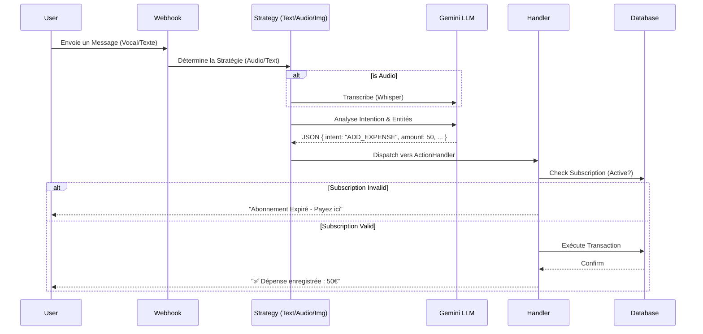

# 📑 Spécifications Fonctionnelles & Architecture - Event-Pilot

## 1. Vision du Produit

**Event-Pilot** est le premier **Système d'Exploitation (OS) Orchestral** pour la gestion d'événements et d'établissements de nuit (Clubs, Maquis, Festivals), entièrement piloté par **Intelligence Artificielle** via une interface **WhatsApp**.

L'objectif est de supprimer la friction des applications traditionnelles (téléchargement, login, formation) en s'intégrant là où les équipes communiquent déjà : WhatsApp.

## 2. Architecture Technique

Le projet repose sur une architecture **Hexagonale (Ports & Adapters)** stricte, garantissant l'indépendance de la logique métier vis-à-vis des technologies externes.

### 2.1 Schéma Global de l'Architecture

```mermaid
graph TD
    User((Utilisateur)) -->|WhatsApp| WA_Cloud[WhatsApp Cloud API]
    WA_Cloud -->|Webhook| EP_Webhook[Event-Pilot Webhook]

    subgraph "Event-Pilot Core (NestJS)"
        EP_Webhook --> Strategy[Message Strategy]

        subgraph "AI Processing"
            Strategy -->|Text/Image/Audio| GEMINI[Google Vertex AI (Gemini)]
            GEMINI -->|Structured Data| Intent[Intent & Entities]
        end

        Intent --> ActionHandler[Action Orchestrator]

        subgraph "Domain Modules"
            ActionHandler --> OrgMod[Organization]
            ActionHandler --> TransMod[Transaction]
            ActionHandler --> SubMod[Subscription]
            ActionHandler --> RepMod[Reporting]
        end

        subgraph "Infrastructure"
            OrgMod --> DB[(PostgreSQL)]
            TransMod --> DB
            SubMod --> Stripe[Stripe Payment]
            RepMod --> PDF[PDF Generator]
        end
    end

    PDF -->|File| WA_Cloud
    ActionHandler -->|Response| WA_Cloud
```

### 2.2 Flux de Traitement des Messages (Orchestration)

Le flux de traitement d'un message suit une logique rigoureuse de "Stratégie -> Analyse -> Action".



## 3. Modules Fonctionnels

### 3.1 Gestion de l'Organisation (Organization)

- **Multi-Entités** : Un utilisateur peut appartenir à plusieurs organisations (ex: Propriétaire de 3 clubs).
- **Rôles Hiérarchiques** :
  - `OWNER` : Accès total, gestion des membres, abonnement, rapports financiers complets.
  - `MANAGER` : Gestion opérationnelle, accès aux rapports limités, ajout de staff.
  - `STAFF` : Saisie simple (dépenses/incidents), pas de visibilité financière globale.

### 3.2 Gestion Financière & Transactions (Transaction)

L'IA permet une saisie "naturelle" des finances.

- **Entrées Multimodales** :
  - _Texte_ : "Achat de 5 caisses de bière pour 20000"
  - _Vocal_ : Enregistrement rapide en plein service.
  - _Photo_ : Photo d'une facture fournisseur -> OCR intelligent.
- **Catégorisation Automatique** : L'IA détecte si c'est une `Dépense` ou un `Revenu`, et assigne la catégorie (Logistique, Boisson, Marketing).

### 3.3 Reporting Automatisé (Report)

Génération de documents professionnels au format PDF.

- **Flash Report** : Résumé de la soirée (Ventes, Dépenses cash, Incidents) envoyé à la fermeture.
- **Weekly Report** : Bilan hebdomadaire consolidé (P&L, Marges) pour les propriétaires.
- **Format** : PDF riche généré via `PDFKit`, partagé directement dans la conversation WhatsApp.

### 3.4 Sécurité & Incidents (Incident)

Un "Main Courante" numérique.

- Signalement rapide d'incidents (Bagarre, Vol, Problème technique).
- Niveaux de sévérité (`LOW`, `MEDIUM`, `HIGH`, `CRITICAL`).
- Alertes temps réel pour le Manager/Owner.

### 3.5 Abonnements & Monétisation (Subscription)

Modèle hybride adapté à l'événementiel :

- **SaaS Mensuel** : Pour les établissements permanents (Clubs, Restaurants). Renouvellement auto via Stripe.
- **Pass Événement (48h)** : Paiement "One-shot" pour un festival ou un concert unique.

## 4. Modèle de Données (Entités Clés)

Les données sont stockées dans PostgreSQL avec une structure relationnelle forte.

| Entité           | Description                                        | Relations Clés                        |
| :--------------- | :------------------------------------------------- | :------------------------------------ |
| **User**         | Utilisateur WhatsApp unique (numéro de téléphone). | Peut être membre de N Organisations.  |
| **Organization** | L'entité légale ou le lieu (Club).                 | Possède N membres, N transactions.    |
| **Message**      | Trace brute de l'interaction (Audit log).          | Lié à une Transaction ou un Incident. |
| **Transaction**  | Écriture financière validée.                       | Montant, Devise, Catégorie, Auteur.   |

## 5. Sécurité

- **Authentification** : Basée sur le numéro de téléphone WhatsApp (vérifié par Meta).
- **Autorisation** : RBAC (Role-Based Access Control) vérifié à chaque action critique.
- **Context-Isolation** : Un utilisateur ne peut interagir qu'avec l'organisation "active". Pour changer, il doit explicitement demander un "Switch".
